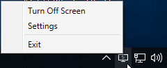
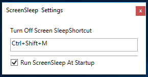


# ScreenSleep 

**ScreenSleep** is a **Windows** application that helps you **put your screens to rest**. 

---

The application **runs** quietly **in the background** and you can either put your screens to sleep from the **Taskbar**:

---

You can also use a **keyboard shortcut** to put your screens to sleep. Configure it from **Settings**:

## Installation

Find the latest release [here](https://github.com/AdrianLungu/ScreenSleep/releases).

Or just download version 1.0.1 from [here](https://github.com/AdrianLungu/ScreenSleep/releases/download/v1.0.1/ScreenSleep-1.0.1.7z).

Just decompress it to your favourite folder and run it as is!

## Getting Help

If you run into any issues using the software, please file an [issue](https://github.com/AdrianLungu/ScreenSleep/issues)!